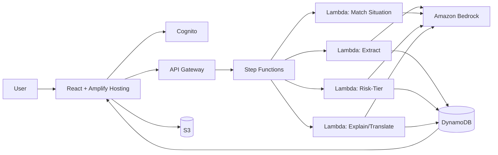

# Spashta

**Situational clarity for rules you can read but can't interpret.**

Built for **First Commit — Bharat Builds Tour 2026, Event 01**, by WeMakeDevs × AWS.
Team: **Caffeine & Code** · Kunal M K ([@KunalMK25](https://github.com/KunalMK25))

> ⚠️ Spashta provides source-grounded decision support and does not replace official institutional/legal guidance.

---

## The problem

Reading a rule isn't the same as knowing what it means for *your* situation. A student with 72% attendance can read "minimum 75% attendance required" and still not know the answer to the question that matters: *can I write my exam?* The answer depends on the interaction between their specific facts and whatever exceptions apply elsewhere in the document — something a plain read, a summary, or a translation doesn't resolve.

## What Spashta does

Upload a document (an academic attendance regulation, to start) and describe your situation in plain language. Spashta:

1. Extracts the document's clauses into structured form
2. Matches your stated situation against the clauses that actually apply
3. Returns a risk-tiered verdict — 🟢 Normal / 🟡 Pay Attention / 🔴 Potential Issue
4. Shows the exact source clause behind every result — tap **"Why?"**
5. Explains it in your language (Kannada first)
6. Checks a full document set for application readiness (✅/❌ per requirement)

Every result is grounded in extracted text. If the pipeline isn't confident, it says so instead of guessing.

## Demo

*(link added after recording — 3-minute walkthrough, "I have 72% attendance, can I write my exam?")*

## Architecture



Full architecture, AI reasoning pipeline schemas, and every service's justification are in [`SPASHTA_BUILD_SPEC.md`](./SPASHTA_BUILD_SPEC.md).

## Tech stack

**Ship It (deployed)**

| Layer | Service |
|---|---|
| Frontend / hosting | React + Amplify Hosting |
| Auth | Amazon Cognito |
| Storage | Amazon S3 |
| Reasoning | Amazon Bedrock |
| Orchestration | AWS Step Functions |
| Compute | AWS Lambda |
| API | Amazon API Gateway |
| Data | Amazon DynamoDB |

**Build It (local, no AWS account)**

| Layer | Technology |
|---|---|
| Agent orchestration | Strands Agents SDK |
| Retrieval | OpenSearch |
| Policy engine | Cedar |
| Local AWS shape | AWS SAM CLI + LocalStack |

## Why AWS is at the core, not the README

Bedrock performs the actual reasoning across four chained, schema-validated stages — extraction, situational matching, risk classification, explanation — not a single bolted-on API call. Step Functions makes that pipeline visible and debuggable rather than one opaque function. The whole stack scales to zero: Lambda, API Gateway, and DynamoDB (on-demand) carry no idle cost between demo runs, and Bedrock calls are bounded to 3–4 per document rather than open-ended chat. Full cost reasoning is in the spec, §22.

## Setup

**Prerequisites:** Node.js, AWS CLI configured, an AWS account with Bedrock model access requested, AWS SAM CLI, Docker (for LocalStack), Strands Agents SDK.

```bash
git clone https://github.com/KunalMK25/spashta.git
cd spashta

# Local (Build It) — no AWS account needed
sam local start-api
# see /infrastructure for LocalStack config

# Cloud (Ship It)
# deploy backend infra
sam deploy --guided
# deploy frontend
cd frontend && npm install && npm run build
amplify publish
```

Full environment variable list in `SPASHTA_BUILD_SPEC.md`, §27. Never commit `.env` files or AWS credentials.

## Known limitations

- Primary demo domain is academic/attendance regulations; other document types (rental agreements, bills) are secondary and may be less polished.
- Demo corpus documents are synthetic, clearly labeled, and not real institutional regulations.
- Kannada is the primary supported regional language at launch; the architecture supports adding more without a redesign.
- Cedar-based explainable access control is a Build It stretch feature, not guaranteed in the deployed Ship It build.

## AI tooling disclosure

Built with the assistance of AI coding tools (Kiro) during the event window, per First Commit's disclosure requirement. Specification and architecture planning were done in advance of the build window, consistent with the event's "learn and prepare beforehand, build during the event" rule.

## License

*(to be finalized before submission)*

## Team

**Caffeine & Code** — Kunal M K, final-year CSE, PES College of Engineering, Mandya.
