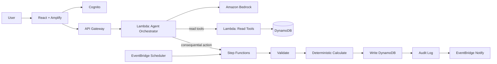

# ROOMIEOPS_BUILD_SPEC.md
**Master Build Specification — RoomieOps**
First Commit — Bharat Builds Tour 2026, Event 01, WeMakeDevs × AWS
Status: **LOCKED**, re-tiered for 4-day feasibility (see note below). Single source of truth for an AI coding agent (Kiro).

> **Re-tiering note:** the source concept doc marks 19 items as P0. That is the full product, not a 4-day scope. This spec keeps every requirement in the source doc — nothing is cut from the product vision — but re-tiers execution priority so P0 is actually finishable. See §11.

---

## 1. Executive Summary

RoomieOps is an AI-powered shared-living operations copilot: **"One household. One shared state. One copilot."** It unifies chores, expenses, maintenance, and shopping under one persistent household state, and lets residents coordinate across all of them through natural language — while a deterministic backend, never the AI, performs financial arithmetic and state mutation. The differentiator is multi-domain coordination (an absence request that touches chores AND expenses AND rotation simultaneously), not any single feature.

---

## 2. Problem Statement

Shared-living coordination — expenses, bills, chores, groceries, maintenance, absences, move-in/move-out — is fragmented across WhatsApp, Splitwise, spreadsheets, screenshots, and memory. No existing tool understands the *relationships* between these domains. A request like *"I'm going home for 10 days — rebalance my chores, check what's affected, tell me what I owe"* requires reasoning across resident state, absence, rotation, and recurring expenses together. That's the gap RoomieOps closes.

---

## 3. Target Users / Personas

| Persona | Need |
|---|---|
| **Resident** (primary) | Coordinate chores/expenses/maintenance without manual tracking |
| **Household admin** (a resident with elevated rights, not a separate role in the MVP) | Manage members, policies, resolve disputes |
| **Maintenance-assigned resident** (P2) | See only issues assigned to them |
| *(Future)* PG/property manager | Multi-property oversight — explicitly out of MVP scope, see §49 |

---

## 4. Existing Solutions

| Category | Covers | Misses |
|---|---|---|
| Splitwise-type apps | Expenses, settlements | Chores, maintenance, absence-awareness |
| PG management software | Tenant admin, KYC, rent | Day-to-day resident coordination |
| Chore apps | Task scheduling | Reasoning across workload/absence/expenses |
| Chat groups | Communication | No structured state, no execution |
| Generic chatbots | Q&A | No live tool use, no validated state mutation |

---

## 5. Existing Gaps

Fragmented workflows; expense apps that don't coordinate chores/maintenance; PG software that's owner- not resident-facing; passive chore systems; chatbots with no operational state; no proactive coordination; no explainability on "why do I owe this"; and the core reliability gap — **an LLM should never be trusted with final monetary arithmetic.** RoomieOps's entire architecture exists to close that last gap specifically (§10).

---

## 6. Product Differentiation

**Not** "Splitwise for roommates." **Not** "AI chatbot for roommates." RoomieOps is a shared-household operating layer where an agent reasons over persistent state and coordinates connected operations: `Resident → Absence → Chores → Expenses → Policies → Events → Actions`. The flagship proof of this is the absence-handling workflow (§2 of source doc, reproduced in §13).

---

## 7. Proposed Solution

```
User request → Intent understanding → Household context retrieval → Tool selection
→ Tool execution → Validation → State mutation → Audit event → Human-readable explanation
```

The LLM: understands intent, extracts parameters, retrieves context, selects tools, coordinates multi-step operations, explains results.
The LLM never: performs final monetary arithmetic, mutates state directly, invents household data, or claims an action succeeded that didn't.
Deterministic backend services: calculate money, reconcile amounts, validate state, execute mutations, enforce authorization, hold the source of truth.

---

## 8. Product Principles

1. AI interprets; deterministic services calculate and execute.
2. Every consequential action is validated, auditable, and idempotent.
3. Never fabricate success, household data, or an explanation not traceable to real stored data.
4. Small and working beats broad and half-built — enforced via §11's tiering, not aspiration.
5. Do not become Splitwise, a generic chatbot, or a PG ERP (§9, must-not-build list carried over in full).

---

## 9. Functional Requirements

All 30 FRs from the source concept are retained below, tagged with their **re-tiered** priority (§11 explains the tiering logic; this is the only place scope actually changed from the source doc).

| FR | Requirement | Tier |
|---|---|---|
| FR-01 | Authentication (Cognito: sign up/in/out, sessions) | **P0** |
| FR-02 | Household creation (id, name, members, policies) | **P0** |
| FR-03 | Member management (add/remove, move-in/out dates); household isolation enforced | **P0** |
| FR-04 | Room management (creation, assignment, occupancy, attributes) | P1 |
| FR-05 | Expense creation (amount, category, payer, participants, split method, notes, receipt) | **P0** (receipt attach is P2) |
| FR-06 | Deterministic split engine — equal split | **P0**; percentage/exact/share/weighted/occupancy/prorated/credits-debits | P2 |
| FR-07 | Payment tracking, balance/history view | **P0** |
| FR-08 | Settlement (net balances); simplification | **P0** net calc, simplification algorithm P2 |
| FR-09 | Chore creation, recurring, assignment, completion, overdue view | **P0** (recurring is P1) |
| FR-10 | Chore rotation (simple round-robin) | **P0**; workload-weighted rotation | P2 |
| FR-11 | Resident absence handling, propose affected chores/expenses | **P1 — this is the flagship demo feature** |
| FR-12 | Grocery/shopping list | P1 |
| FR-13 | Inventory tracking, low-stock events | P2 |
| FR-14 | Maintenance issue creation (fields per source doc) | P1 (creation + status only) |
| FR-15 | Maintenance workflow (classify → prioritize → assign → escalate → resolve) | P2 |
| FR-16 | AI copilot: intent, entities, tool selection/execution, explanation | **P0** for single-intent commands |
| FR-17 | Multi-step agent workflows | **P1 — powers the flagship scenario** |
| FR-18 | Tool-based agent architecture (full tool registry, §14) | **P0** for the P0-tier tools; full registry fills in as each domain reaches its own tier |
| FR-19 | Confirmation for consequential actions | **P1** |
| FR-20 | Notifications (bill due, overdue, chore due/overdue, maintenance) | P1 (basic), P2 (cadence control) |
| FR-21 | Event-driven automation (EventBridge → Lambda) | P1 |
| FR-22 | Scheduled workflow via EventBridge; multi-stage via Step Functions | **P0 for Step Functions on consequential actions**; EventBridge scheduling is P1 |
| FR-23 | Receipt/bill processing (S3 → Textract → structured expense) | P2 |
| FR-24 | Household policies (structured config) | P1 (basic default-split policy only) |
| FR-25 | Explainable balances (traceable breakdown) | **P0** |
| FR-26 | Audit trail | **P0** (basic: actor/action/timestamp/requestId); full workflow-ID linkage | P1 |
| FR-27 | Search/retrieval (OpenSearch) | P2 |
| FR-28 | Authorization (resource-level; Cedar for fine-grained cases) | **P0** basic ownership check; Cedar fine-grained | P2 |
| FR-29 | Error handling — never claim success on backend failure | **P0** |
| FR-30 | Idempotent mutations | **P0** |

---

## 10. Non-Functional Requirements

All 17 NFRs retained. The load-bearing ones for P0, verbatim from the source doc's intent:

- **NFR-01/02 (Financial accuracy/reconciliation):** integer-paise money; `SUM(allocations) == expense total` after deterministic rounding — enforced in code, tested independently of any AI (§17).
- **NFR-08/09 (AI safety / deterministic mutation):** the AI never invents state, never bypasses financial logic, never fabricates success; important mutations only through validated backend services.
- **NFR-10 (Idempotency):** every write accepts a client-supplied `requestId`.
- **NFR-14 (Maintainability):** AI reasoning, financial logic, DB access, auth, notifications, and workflow orchestration stay in separate, clearly-owned modules — no monolith Lambda.
- **NFR-15 (Observability):** log requestId/householdId/userId/intent/tool/workflow/success/latency; never log secrets or payment credentials.
- The remaining NFRs (03, 04–07, 11–13, 16–17 — reliability, security, privacy, auditability, explainability, performance, availability, scalability, extensibility, UX simplicity) apply throughout and are not separately tiered — they're properties of how P0/P1/P2 work gets built, not features to schedule.

---

## 11. MVP / P0 / P1 / P2 Scope (re-tiered — see note at top of document)

**P0 — must work by end of Day 2, demo depends on it:**
Auth · household + member creation · expense creation with equal-split · balance calc + explainable breakdown · chore creation + simple rotation + completion/overdue · single-intent AI copilot commands with real tool calls · basic audit log · ownership-level authorization · idempotency · honest error handling (never fabricate success).

**P1 — should work by end of Day 3:**
Flagship absence-handling multi-step workflow · confirmation flow for consequential actions · maintenance issue creation (no escalation) · simple shopping list · EventBridge reminders · basic household policies · room management if time allows · recurring chores/bills.

**P2 — stretch, only after P0+P1 are solid:**
Remaining 7 split methods · Textract receipt extraction · Cedar fine-grained authorization · OpenSearch retrieval · inventory + low-stock events · maintenance escalation workflow · settlement simplification · notification cadence control · workload-weighted rotation.

**Never build (carried over from source doc in full):** roommate discovery marketplace, social feed, dating/social features, full accounting/PG ERP, food delivery, a payment gateway (unless explicitly requested later), blockchain, biometric access, unnecessary IoT/sensors, a generic document chatbot, a generic "ask AI anything" assistant.

**Rule:** never trade P0 for P1/P2. If the flagship absence workflow (P1) isn't reliable by Day 3, demo it against seeded data as a real-but-rehearsed walkthrough rather than cutting P0 to chase it live.

---

## 12. System Architecture



---

## 13. AI Agent Architecture

1. **Intent + entity extraction** (Bedrock) — free text → structured intent/entities.
2. **Tool selection** — the model picks from the fixed registry (§14); it never executes state changes itself, only emits a tool call.
3. **Deterministic execution** — read tools hit DynamoDB via Lambda directly; write (consequential) tools invoke Step Functions.
4. **Explanation** (Bedrock) — summarizes a result that already happened; cannot alter it.

**Flagship multi-step workflow (the demo anchor, P1):**
`get_member → get_absence → get_chore_rotation → identify_affected_tasks → get_recurring_expenses → identify_affected_expenses → generate_proposal` — read-only chain builds a proposal; applying it goes through the same validated write path as any other consequential action, gated on user confirmation (FR-19).

---

## 14. Tool Architecture

| Domain | Tools (P0 tools marked) |
|---|---|
| Household | `get_household_state` **P0**, `get_household_policy` (P1), `get_member` **P0**, `get_room` (P1) |
| Expenses | `get_expenses` **P0**, `create_expense` **P0**, `calculate_split` **P0** (equal only), `get_balances` **P0**, `record_payment` **P0**, `simplify_settlement` (P2) |
| Chores | `get_chore_rotation` **P0**, `create_chore` **P0**, `assign_chore` **P0**, `complete_chore` **P0**, `rebalance_chore` (P1) |
| Maintenance | `create_issue` (P1), `get_open_issues` (P1), `assign_issue` (P2), `update_issue` (P2) |
| Shopping | `get_inventory` (P2), `add_shopping_item` (P1), `mark_item_purchased` (P1) |
| Automation | `create_reminder` (P1), `get_upcoming_events` (P1) |
| Audit | `get_event_history` **P0** (basic), `get_audit_record` (P1, richer) |

All tools validate inputs server-side regardless of tier — a P1/P2 tool being unbuilt is fine; a built tool skipping validation is not.

---

## 15. Data Model / 16. DynamoDB Design

Single table, `PK`/`SK`, to stay feasible in 4 days:

| Entity | PK | SK | Notes |
|---|---|---|---|
| Household | `HOUSEHOLD#<id>` | `META` | name, policies |
| Member | `HOUSEHOLD#<id>` | `MEMBER#<userId>` | role, moveIn/moveOut, absence period |
| Room *(P1)* | `HOUSEHOLD#<id>` | `ROOM#<roomId>` | attributes |
| Chore | `HOUSEHOLD#<id>` | `CHORE#<choreId>` | assignee, status, recurrence, rotation position |
| Expense | `HOUSEHOLD#<id>` | `EXPENSE#<expenseId>` | amount (paise), payer, participants, splitMethod |
| Balance | `HOUSEHOLD#<id>` | `BALANCE#<userId>` | net amount |
| MaintenanceIssue *(P1)* | `HOUSEHOLD#<id>` | `ISSUE#<issueId>` | category, severity, status, assignee |
| ShoppingItem *(P1)* | `HOUSEHOLD#<id>` | `ITEM#<itemId>` | status |
| AuditLog | `HOUSEHOLD#<id>` | `AUDIT#<ts>#<id>` | actor, action, before/after, requestId |

All money as integer paise. Idempotency key stored on every write record.

---

## 17. API Specification

| Endpoint | Auth | Purpose | Tier |
|---|---|---|---|
| `POST /households` | Required | Create household | P0 |
| `POST /households/{id}/members` | admin | Add member | P0 |
| `POST /households/{id}/chat` | Required | NL request → agent orchestrator | P0 |
| `POST /households/{id}/expenses` | Required | Direct expense creation | P0 |
| `GET /households/{id}/balances` | Required | Current balances | P0 |
| `GET /households/{id}/chores` | Required | Chore list/status | P0 |
| `POST /households/{id}/actions/{id}/confirm` | Required | Confirm pending consequential action | P1 |
| `POST /households/{id}/maintenance` | Required | Report issue | P1 |
| `POST /households/{id}/receipts` | Required | Upload receipt | P2 |

All write endpoints require a client-generated `requestId`.

---

## 18. Event Model / 19. Step Functions Workflows / 20. EventBridge Workflows

**Step Functions (P0 for the pipeline shape, applied wherever a consequential action exists at whatever tier that action is built):**
`Validate → Deterministic Calculate → Write DynamoDB → Audit → (optional) EventBridge Notify`. This is the enforced, code-level version of "the AI never does the arithmetic" — the single most important architectural fact in the project.

**EventBridge (P1):** scheduled triggers for bill-due and chore-overdue reminders → Lambda → inspect state → notify. Maintenance-SLA escalation (P2) follows the same shape once maintenance workflow exists.

---

## 21. Financial Calculation Architecture

Deterministic engine, isolated from AI code entirely (NFR-14). P0 supports equal split only; the engine's interface is designed so P2's seven additional methods (exact/percentage/share/weighted/occupancy/prorated/credit-debit) are new calculation functions behind the same `calculate_split` interface, not a rewrite. Every calculation enforces `SUM(allocations) == original amount` via remainder reconciliation (assigned deterministically, e.g. to the payer) before any write.

---

## 22. Chore Rotation Architecture

P0: simple round-robin queue per recurring chore, advanced on completion or explicit reassignment. P2: workload-weighted rotation using per-chore weights (source doc's bathroom=5/mopping=4/trash=2/groceries=3 example) and historical completion counts to propose fairer assignments.

---

## 23. Maintenance Workflow

P1: report → stored with status `open`. P2: full `report → classify → prioritize → assign → track → escalate → resolve` pipeline with duplicate-active-issue prevention and SLA-based escalation via EventBridge.

---

## 24. Receipt-Processing Workflow (P2)

`Upload → S3 → Textract → structured fields → validation/correction UI → expense creation`. Low-confidence extractions are never auto-posted — they route to a review step before becoming an expense record (mirrors NFR-08's "never fabricate" principle applied to OCR confidence, not just AI confidence).

---

## 25. Authentication

Amazon Cognito — sign up/in/out, session management. P0.

## 26. Cedar Authorization (P2 for Ship It; Build It differentiator)

Resident-scoped access, admin policy management, maintenance-staff issue-scoped access, cross-household denial. P0 substitutes a simple ownership/membership check in code; Cedar replaces that check when P2 is reached, not alongside it.

---

## 27. Security / 28. Privacy

Cognito auth, least-privilege IAM, no payment credentials stored, household data isolation enforced at the query layer (every DynamoDB access scoped by `HOUSEHOLD#<id>` partition key), no secrets logged (NFR-15).

---

## 29. Error Handling

Every tool call and Step Functions execution result is checked before the agent generates any explanation — a failed backend call never produces a "success" explanation (NFR-08, FR-29). Ambiguous requests trigger a clarification question, not a guess.

---

## 30. Idempotency

Every write-path tool and API endpoint requires a client-supplied `requestId`; the backend treats a repeated `requestId` as a no-op returning the original result, not a new mutation.

---

## 31. Observability

Log requestId, householdId, userId, intent, tool used, workflow execution, success/failure, latency. Never log passwords, secrets, tokens, or payment data.

---

## 32. Frontend Information Architecture / 33. UX Flows

- **Dashboard:** pending chores, balances, recent activity.
- **Copilot chat:** NL input, agent response, pending-confirmation cards for consequential actions (P1).
- **Expenses:** list + manual add-expense fallback.
- **Chores:** rotation view, completion, overdue flags.
- **Balance detail:** explainable breakdown (FR-25).
- *(P1/P2)* Maintenance list, shopping list, room view.

Primary UX flow: dashboard → ask copilot a question → (if consequential) confirm → see updated dashboard + explanation.

---

## 34. Testing Strategy

| Area | Cases |
|---|---|
| Split engine | equal split with remainder reconciliation, single payer, excluded participant |
| Balance calc | multi-expense net balance |
| Chore rotation | round-robin correctness, missed-chore detection |
| Agent tool selection | correct tool for single-intent commands; correct multi-tool chain for flagship scenario (P1) |
| Idempotency | duplicate `requestId` does not double-write |
| Confirmation flow (P1) | consequential action blocked until confirmed |
| Failure handling | Bedrock failure, malformed tool-call JSON, Step Functions failure |
| Security | cross-household access denied |

## 35. Evaluation Benchmark

A fixed seed dataset (§13's Room 302 household) with known-correct answers for: balance after N expenses, chore assignee after N rotations, and the flagship absence proposal's expected output. Every pipeline change is checked against this fixed set before being considered "working" — this is what makes "it works" a testable claim during the demo, not an assertion.

## 36. Success Metrics (for your own tracking, not judged directly)

P0 feature completion by end of Day 2; flagship workflow reliability (does it produce the correct proposal on the seed dataset, every run); zero duplicate-write incidents under repeated-request testing; demo runs clean on the seed household without live improvisation.

---

## 37. AWS Service Justification

| Service | Job | Why it earns its place |
|---|---|---|
| Cognito | Auth | Managed, no reason to hand-roll |
| API Gateway | Entry point | Standard REST front door |
| Lambda | Orchestrator + read tools + write triggers | Stateless, scale-to-zero, matches bursty per-request load |
| Bedrock | Intent, tool selection, explanation | The actual reasoning engine — architecturally central |
| DynamoDB | Household state, source of truth | Simple key-value pattern, no relational need |
| Step Functions | Consequential-action pipeline | Where "AI never does arithmetic" becomes enforced, auditable code |
| EventBridge (P1) | Scheduled reminders | Legitimate event-driven automation |
| S3 + Textract (P2) | Receipt extraction | Optional — expenses work fine without it |
| OpenSearch (P2) | Retrieval over policies/history | Least load-bearing service in the stack — honest weak point if a judge asks |
| Amplify Hosting | Frontend | "A URL in minutes" |

---

## 38. Build It Architecture

Strands Agents SDK (local agent orchestration, same reasoning loop as Bedrock, portable offline) · OpenSearch local (P2) · Cedar (P2, the Build It differentiator — explainable resident/admin/maintenance-scoped access) · SAM CLI + LocalStack (same Lambda/DynamoDB code runs in both tracks).

## 39. Ship It Architecture

As diagrammed in §12 — Amplify/Cognito/API Gateway/Lambda/Bedrock/DynamoDB/Step Functions, EventBridge and Textract/OpenSearch layered in at their respective tiers.

---

## 40. Four-Day Implementation Plan

- **Day 1:** repo, Cognito/DynamoDB/API Gateway scaffold, deterministic split + balance engine (unit-tested independently — this must never be flaky).
- **Day 2:** chore CRUD + rotation, Bedrock single-intent agent wired end-to-end (P0 complete).
- **Day 3 (in-person mentor day):** Step Functions consequential pipeline, flagship absence workflow, confirmation flow, maintenance/shopping basics, UI polish.
- **Day 4:** EventBridge reminders if time, Build It parity (Strands/SAM/LocalStack), testing against §34/§35, deployment, demo rehearsal, submission.

---

## 41. Demo Flow (3 minutes)

0:00–0:20 problem → 0:20–0:45 "I paid ₹2,400 for groceries, split between me/Rahul/Arjun/Rohan" → 0:45–1:10 "Rahul didn't clean this week" → reassignment → 1:10–1:45 flagship absence scenario, proposal shown and confirmed → 1:45–2:15 architecture + cost story → 2:15–2:45 Build It + Cedar moment (if reached) → 2:45–3:00 close.

---

## 42. Judge Q&A

- **Why does this need AI?** Multi-domain reasoning over free text (the absence scenario) — deciding which unrelated systems a situation touches isn't a form.
- **What if the AI gets the math wrong?** It can't — arithmetic lives in the deterministic Step Functions pipeline, tested independently (§35).
- **Why Step Functions?** It's where that separation becomes enforced code, not a design intention.
- **Why is so much marked P2?** Because judging rewards a small thing that works over a big thing that mostly does — this doc is honest about what's core versus stretch, on purpose.
- **What's the cost model?** Bounded per-request Bedrock calls, on-demand DynamoDB, scale-to-zero throughout.

---

## 43. Failure Modes

| Failure | Detection | UX | Recovery |
|---|---|---|---|
| Invalid tool-call JSON | Schema validation | "Couldn't understand that — try rephrasing" | Retry once, then clarify |
| Split doesn't reconcile | Sum check | Blocked pre-write | Deterministic remainder assignment |
| Step Functions failure | Execution status | "Nothing was changed" | Retry policy, no partial writes |
| Duplicate request | Idempotency key seen | Silent no-op | — |
| Unauthorized access | Membership check | 403 | No data returned |

---

## 44. Definition of Done

```
Login → create/join household → add members → record expense (equal split) → see
explainable balance → create/complete chores, see overdue → ask copilot a single-intent
question, get a real tool-backed answer → run the flagship absence scenario, see and
confirm a proposed plan
```

---

## 45. Repository Structure

```
roomieops/
├── frontend/
├── backend/
│   ├── lambdas/
│   └── stepfunctions/
├── infrastructure/
├── prompts/
├── data/            # seed household + evaluation benchmark (§35)
├── tests/
└── docs/
```

## 46. Environment Variables

`AWS_REGION`, `BEDROCK_MODEL_ID`, `COGNITO_USER_POOL_ID`, `COGNITO_CLIENT_ID`, `DYNAMODB_TABLE_NAME`, `STEP_FUNCTIONS_ARN`, `API_GATEWAY_URL`. Never commit values.

## 47. Deployment Plan

Local dev/testing throughout Days 1–3 via SAM local + LocalStack; first real Amplify/Cognito/Bedrock deployment happens once P0 passes §34/§35 locally (targeted Day 3 evening); Day 4 is stabilization and demo rehearsal against the deployed environment, not first-time deployment.

---

## 48. Responsible AI Requirements

The agent never mutates state directly, never fabricates data or success, always requires confirmation for consequential actions (P1), and every explanation traces to real stored data (NFR-07). In-product note: *RoomieOps coordinates household operations and calculations deterministically; the AI assists with understanding requests and explaining results, not with performing financial arithmetic.*

## 49. Future Extensions (explicitly not MVP)

UPI payment handoff, multilingual interaction, voice, predictive expense anomaly detection, advanced fairness models, multi-property PG manager support, staff workflows.

## 50. Final Checklist

- [x] Every FR/NFR from the source concept retained, none silently dropped
- [x] P0 re-tiered to a genuinely 4-day-feasible set (§11)
- [x] AI never performs final arithmetic — enforced via Step Functions (§10, §21)
- [x] Flagship absence workflow specified as P1 demo centerpiece
- [x] Must-not-build list carried over in full (§11)
- [x] AWS service justification given for every service, including the weak ones (§37)
- [x] Build It and Ship It share one codebase (§38/§39)
- [x] Testing strategy includes a fixed evaluation benchmark, not just ad hoc cases (§35)
