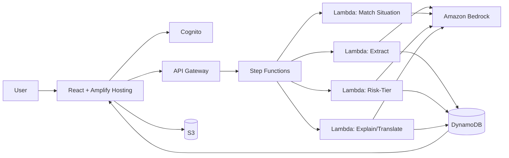
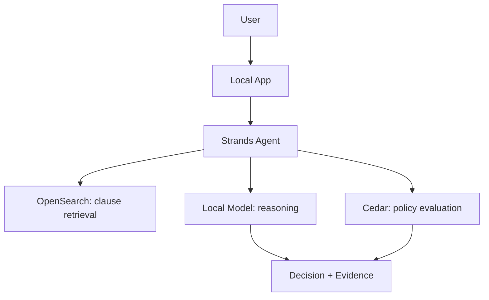

# SPASHTA_BUILD_SPEC.md
**Master Build Specification — Spashta 2.0**
First Commit — Bharat Builds Tour 2026, Event 01, WeMakeDevs × AWS
Status: **LOCKED**. This document is the single source of truth for implementation. No redesign, renaming, domain change, or scope expansion without explicit approval.

---

## 1. Problem Title

**Spashta: Situational Clarity for Rules You Can Read But Can't Interpret**

---

## 2. Problem Statement

Students and families across India routinely receive bureaucratic documents and regulations — academic attendance policies, examination eligibility rules, medical exemption/condonation provisions, scholarship rules, rental agreements, utility bills. The deeper problem is not that these documents are unreadable; most are technically legible. The problem is that **reading a rule is not the same as knowing what it means for your specific situation.**

A student with 72% attendance can read the sentence "minimum 75% attendance required" and still not know the answer to the question that actually matters: *can I write my exam?* The real answer depends on the interaction between their specific facts (72%, a hospitalization, a possible condonation clause elsewhere in the document) and the applicable exceptions — something a plain read, a summary, or a translation does not resolve.

Users need:
- To know **which clauses apply** to their specific stated situation
- **Evidence** for why a conclusion was reached, not just an assertion
- The explanation in a **regional language** where useful
- Confidence that the system is **not guessing** when it isn't sure

Spashta is **source-grounded decision support** for exactly this gap. It is explicitly **not** a legal advisor, not an eligibility guarantee, and does not replace official institutional guidance — this is stated in-product, not buried in a README.

---

## 3. Proposed Solution

Core journey (locked, do not shorten or reorder):

```
Upload document
      ↓
Describe your situation
      ↓
Extract relevant clauses
      ↓
Match clauses against the user's situation
      ↓
Risk-tier the result
      ↓
Show exact source evidence
      ↓
Explain "Why?"
      ↓
Translate/explain in selected language
```

**Risk tiers (the primary output shape):**

| Tier | Meaning |
|---|---|
| 🟢 Normal | No significant issue detected based on the available clauses |
| 🟡 Pay Attention | A condition, exception, missing requirement, or ambiguity exists that the user needs to check |
| 🔴 Potential Issue | The user's stated situation appears to conflict with a relevant requirement |

**Non-negotiable rule:** every 🟡/🔴 result must carry (a) the relevant clause, (b) the source text, (c) an explanation, (d) the reasoning basis, and (e) a confidence indicator. The model is never allowed to produce an unsupported conclusion — if it can't ground a result in extracted text, it reports low confidence instead of guessing (see §21).

---

## 4. Existing Solutions and Their Gaps

| Category | What it does | Gap Spashta closes |
|---|---|---|
| Traditional document reading | Manual search through PDFs/regulations | Slow, difficult language, zero reasoning about the reader's own circumstances |
| Generic OCR/extraction | Pulls text out of a document | Extraction ≠ understanding; doesn't connect text to a person's situation |
| Generic summarizers | Condense a document | A summary can hide the one clause that matters and never exposes *why* a conclusion was reached |
| Generic PDF/RAG chatbots | Answer questions about a document | Behave as Q&A wrappers — no structured risk tiers, no guaranteed evidence trail, no access-control reasoning |
| Translation tools | Translate text | Translation alone doesn't determine what a rule means for the user |
| Traditional RBAC/ACL | Allow/deny document access | Returns a bare decision with no human-readable reasoning |

Spashta's differentiation is that it combines **document extraction + situational reasoning + evidence grounding + risk classification + local-language explanation + readiness checking + explainable authorization** in one pipeline, rather than solving a single layer of this problem the way each category above does.

---

## 5. Why Spashta Fits Build It and Ship It

### Build It

| Technology | Responsibility | Why Spashta needs it | Cost of removing it | Demo appearance |
|---|---|---|---|---|
| **Strands Agents SDK** | Orchestrates the local reasoning workflow (extraction → matching → risk-tier → explanation) against a local model | Without an orchestration layer this collapses into one giant prompt, which is exactly what §11 forbids | Loses the chained-reasoning story entirely; becomes "a prompt," not "an agent" | Shown running the full pipeline offline, no cloud dependency |
| **OpenSearch (local)** | Retrieval over extracted clauses; also powers "is this clause unusual" comparison for the checklist feature | Grounds answers in retrieved text instead of model memory — this is what makes evidence citation possible offline | Reasoning would have no retrieval step, undermining the evidence-grounding claim | Shown returning the specific clause a risk result cites |
| **Cedar** | Evaluates access requests for shared documents (family/hostel context) | This is the Build It differentiator (§ locked) — a real declarative policy engine, not a hardcoded if-statement | Loses the entire explainable-authorization feature | "Why can't Rahul view this?" demo moment |
| **SAM CLI** | Packages/runs the Lambda-shaped functions locally in an AWS-equivalent shape | Lets the exact same function code run in Build It and Ship It, which is what makes "one codebase, two tracks" true rather than a claim | Build It and Ship It would diverge into two separate implementations, doubling the work | Not demoed directly — shown via local pipeline working before deploy |
| **LocalStack** | Simulates S3/DynamoDB locally for offline development and testing | Lets you build and test the Ship It data layer without an AWS bill during prep | Local dev would need a live AWS account even for Build It-track work | Not demoed directly — a development-time tool |

### Ship It

| Service | Input | Output | Why appropriate | Cost consideration |
|---|---|---|---|---|
| **Amplify Hosting** | Git push | Live URL | "A URL in minutes," matches the track's own framing | Static hosting, effectively free at hackathon scale |
| **Cognito** | Email/password | Auth token | Simple, managed auth; no reason to hand-roll this | Free tier covers hackathon traffic |
| **S3** | Uploaded document (photo/PDF) | Stored object + presigned URL | Standard object storage for user documents; presigned URLs avoid routing files through Lambda | Pay-per-GB-stored, negligible at demo scale |
| **Bedrock** | Extracted text + user situation | Structured JSON per pipeline stage (§11) | This is where the actual reasoning happens — the architectural center of the project, not a bolted-on call | Pay-per-token; each pipeline run is 3–4 bounded calls, not open-ended chat, so cost per document is predictable and small |
| **Step Functions** | Trigger from API Gateway | Orchestrated 4-stage execution with state tracking | Makes the multi-stage pipeline visible and debuggable, and is the single strongest "built on AWS" argument in the whole architecture | Pay-per-state-transition; a 4-stage pipeline is a handful of transitions per document |
| **Lambda** | Step Functions stage invocation | Stage result | One function per pipeline stage keeps each stage independently testable (§8 maintainability) | Scales to zero between hackathon demo runs — no idle cost |
| **API Gateway** | HTTP request from frontend | Routed to Lambda | Standard REST entry point; no reason to expose Lambda directly | Pay-per-request, negligible |
| **DynamoDB** | Document record writes/reads | Stored/retrieved document state | Simple key-value access pattern (one item per document) doesn't need a relational DB | On-demand capacity mode — scales to zero, no provisioned cost |
| **EventBridge** *(stretch only)* | Scheduled trigger | Reminder Lambda invocation | Only added if a renewal-reminder stretch feature is reached — not part of the core pipeline | Not part of core cost story |



---

## 6. If Someone Steals the Idea

Ideas are copyable. Execution depth is not.

**What another team could copy after seeing the demo:** the project concept, the general problem framing, the risk-tier UI shape, basic document upload, the broad feature list.

**What they cannot easily reproduce in the same four days:**
1. The reasoning pipeline itself (extraction → situational matching → evidence grounding → risk classification, as four distinct, testable stages)
2. The evaluation corpus — a carefully constructed academic-regulation set with real edge cases (threshold cases, exemption cases, missing-document cases, ambiguous clauses)
3. The prompt/reasoning design tuned against the specific failure modes found during actual development
4. The evidence UX (risk result → "Why?" → exact clause → explanation) working reliably
5. Graceful failure handling — confidence thresholds and fallback messaging instead of fabrication
6. A working Build It implementation where Strands + OpenSearch + Cedar genuinely cooperate, not three separate demos stapled together
7. Cedar explainability specifically — "denied because policy X, restricted to Y" rather than a bare deny
8. A real Step Functions + Lambda + Bedrock pipeline rather than one AI API call bolted onto a CRUD app
9. A demo corpus with known, reliably reproducible edge cases
10. A demo narrative understandable in three minutes

The moat is the combination — reasoning pipeline + evidence grounding + corpus + failure handling + AWS architecture + Cedar authorization + rehearsed execution — not the idea in isolation. No claim of legal protection or literal impossibility of copying is made.

---

## 7. Functional Requirements

- **FR-01 — Authentication.** Users register/login via Cognito.
- **FR-02 — Document upload.** Users upload a photo or PDF; stored in S3.
- **FR-03 — Situation input.** Users describe their situation in natural language (e.g., "I have 72% attendance and missed classes because I was hospitalized").
- **FR-04 — Document extraction.** Extract relevant text/clauses from the uploaded document.
- **FR-05 — Structured representation.** Represent extracted clauses in structured form, each with identifiers/metadata sufficient for citation.
- **FR-06 — Situational matching.** Determine which clauses are relevant to the stated situation.
- **FR-07 — Risk classification.** Produce 🟢/🟡/🔴 results.
- **FR-08 — Evidence citation.** Every important result references its source clause.
- **FR-09 — "Why?" explanation.** Users can expand a result to see why it received its tier.
- **FR-10 — Local-language explanation.** At least one Indian regional language, Kannada as the primary demo language.
- **FR-11 — Confidence/failure handling.** Insufficiently confident extraction/reasoning must not fabricate an answer; show a fallback (e.g., "We couldn't confidently read this clause — try a clearer photo or check the highlighted section manually").
- **FR-12 — Readiness checklist.** Evaluate a set of related documents for completeness (e.g., attendance certificate ✅, medical certificate ❌, application form ✅, supporting document ❌).
- **FR-13 — Result storage.** Store processing status and results in DynamoDB.
- **FR-14 — Processing status.** Show live stages: "Reading document… Checking clauses… Applying your situation… Preparing explanation…"
- **FR-15 — Cedar authorization (Build It).** Explainable access decisions for shared documents — allow/deny + applicable policy + human-readable explanation.

---

## 8. Non-Functional Requirements

- **Performance:** demo-reasonable response time; document analysis runs asynchronously so the UI never blocks.
- **Reliability:** failed processing must not corrupt stored results; errors surface as user-friendly messages, not stack traces.
- **Security:** authenticated users only; document ownership enforced; no public raw-document access; presigned S3 URLs for upload/download; Cedar governs Build It shared-document access.
- **Privacy:** documents may contain sensitive information — never expose beyond the owner and explicitly authorized viewers.
- **Explainability:** every AI result must point to the source clause it's based on.
- **Maintainability:** Lambda functions stay modular, one responsibility per function.
- **Testability:** extraction/reasoning logic is testable independently of the UI.
- **Scalability:** serverless, pay-per-use, scale-to-zero wherever applicable.
- **Accessibility:** readable UI, clear risk indicators, plain language.
- **Localization:** architecture permits adding more Indian languages later without a redesign.
- **Hackathon feasibility:** every requirement above must be achievable inside four days — this constraint outranks completeness.

---

## 9. Tech Stack

### Ship It

| Layer | Technology |
|---|---|
| Frontend | React |
| Hosting | Amplify Hosting |
| Auth | Amazon Cognito |
| Storage | Amazon S3 |
| AI | Amazon Bedrock |
| Orchestration | AWS Step Functions |
| Compute | AWS Lambda |
| API | Amazon API Gateway |
| Database | Amazon DynamoDB |
| Stretch | Amazon EventBridge |

### Build It

| Layer | Technology |
|---|---|
| Agent orchestration | Strands Agents SDK |
| Retrieval | OpenSearch |
| Policy engine | Cedar |
| Local packaging | AWS SAM CLI |
| Local AWS simulation | LocalStack |

### Supporting dependencies (not core First Commit platform)
- Language: TypeScript/JavaScript (frontend + Lambda), Python acceptable for Lambda if faster to write
- Testing: Jest (frontend/Lambda unit tests), pytest if Python is used
- Frontend libraries: standard React tooling only — no unrelated cloud SDKs
- Infrastructure config: SAM template (`template.yaml`)

No cloud platform outside AWS is introduced. No AI service outside Bedrock (Ship It) / a local model via Strands (Build It) is introduced.

---

## 10. Complete System Architecture

**High-level:** see the Mermaid diagram in §5.

**Build It architecture:**



**AI reasoning pipeline:** see §11.

**Authentication/authorization flow:**
```
User → Cognito (Ship It) / local session (Build It)
     → Document ownership check (DynamoDB owner field / local store)
     → Cedar policy check only for shared-document access requests
```

**Document processing flow:** Upload → S3 → API Gateway trigger → Step Functions → 4 Lambda stages → DynamoDB write → frontend polls/reads result.

**Error/fallback flow:** any stage failure → Step Functions error state → status field set to `failed` with a reason code → frontend shows the FR-11 fallback message, never a raw error.

---

## 11. AI Reasoning Architecture

**Forbidden shape:** `document → one giant prompt → answer`.

**Required shape — four chained stages**, each with its own input/output schema:

### Stage 1 — Extraction
- **Input:** raw document text (post-OCR/vision read)
- **Output:**
```json
{
  "clauses": [
    { "clauseId": "c1", "text": "Minimum attendance required is 75%.", "section": "4.2" }
  ]
}
```
- **Validation:** reject if `clauses` is empty; retry once, then fall back to FR-11.

### Stage 2 — Situational Matching
- **Input:** `clauses[]` + user's stated situation (free text)
- **Output:**
```json
{
  "matches": [
    { "clauseId": "c1", "relevance": "direct", "userFact": "72% attendance" }
  ]
}
```
- **Validation:** every match must reference a real `clauseId` from Stage 1 output — reject and retry if a `clauseId` doesn't exist.

### Stage 3 — Risk Classification
- **Input:** `matches[]`
- **Output:**
```json
{
  "riskTier": "red",
  "clauseId": "c1",
  "reasoning": "Stated attendance (72%) is below the 75% threshold in clause 4.2.",
  "confidence": "high"
}
```
- **Validation:** `riskTier` must be one of `green|yellow|red`; `confidence` must be one of `high|medium|low`. If `low`, the frontend shows the FR-11 fallback instead of the tier.

### Stage 4 — Explanation/Translation
- **Input:** Stage 3 output + target language
- **Output:**
```json
{ "explanation": "...", "language": "kn" }
```
- **Validation:** never invoked on a Stage 3 result with `confidence: low`.

**Source-citation mechanism:** every stage after extraction carries forward the originating `clauseId`; the frontend always resolves the citation back to Stage 1's `text` field, so the "Why?" view never shows anything the model invented.

---

## 12. Data Model (DynamoDB)

Single table, partition key `documentId`.

| Attribute | Type | Notes |
|---|---|---|
| `documentId` | String (PK) | UUID |
| `ownerId` | String | Cognito user id |
| `docType` | String | e.g. `academic_regulation`, `rental_agreement` |
| `extractedClauses` | List | Stage 1 output |
| `riskFlags` | List | Stage 3 outputs |
| `explanation` | Map | Stage 4 output, keyed by language |
| `language` | String | last-selected language |
| `status` | String | `processing`\|`complete`\|`failed` |
| `createdAt` | String (ISO 8601) | |

Example record:
```json
{
  "documentId": "d-001",
  "ownerId": "u-123",
  "docType": "academic_regulation",
  "extractedClauses": [{ "clauseId": "c1", "text": "...", "section": "4.2" }],
  "riskFlags": [{ "riskTier": "red", "clauseId": "c1", "confidence": "high" }],
  "explanation": { "en": "...", "kn": "..." },
  "language": "kn",
  "status": "complete",
  "createdAt": "2026-09-17T10:00:00Z"
}
```
No secondary indexes required at hackathon scale — all reads are by `documentId`.

---

## 13. API Specification

| Endpoint | Auth | Request | Response | Downstream |
|---|---|---|---|---|
| `POST /documents` | Required | `{ docType }` | `{ documentId, uploadUrl }` (presigned S3 URL) | S3 |
| `POST /documents/{id}/process` | Required, owner-only | `{ situation }` | `{ status: "processing" }` | Step Functions |
| `GET /documents/{id}` | Required, owner-only | — | Full document record (§12) | DynamoDB |

Error responses: `401` unauthenticated, `403` not the document owner, `404` unknown `documentId`, `422` malformed situation text, `500` pipeline failure (with a user-safe `reason` field, per §20).

---

## 14. UI/UX Specification (mobile-first)

- **Screen 1 — Upload:** camera/photo/PDF picker, document-type selector, situation text input.
- **Screen 2 — Processing:** live stage labels ("Reading document… Finding relevant clauses… Checking your situation… Preparing explanation…").
- **Screen 3 — Results:** overall status, 🟢🟡🔴 risk cards, tappable "Why?" revealing the exact clause, explanation text, language toggle.
- **Screen 4 — Readiness Checklist:** per-document ✅/❌ completeness list.
- **Screen 5 — Access Decision (Build It stretch):** "Why can't Rahul access this document?" → Cedar decision + explanation.

---

## 15. Sample Data / Demo Corpus

Priority corpus (build before Day 1, clearly labeled as **synthetic/demo documents**, not real institutional regulations):
1. Attendance regulation (states the 75% threshold)
2. Examination eligibility regulation
3. Medical exemption/condonation policy
4. Scholarship eligibility regulation
5. Academic attendance circular
6. Supporting-document requirement document

Required edge cases within this corpus:
- Student above threshold (clean 🟢)
- Student below threshold, no exemption (clean 🔴)
- Student below threshold, valid medical exemption (🟡 → resolves toward 🟢 with the right documentation)
- Student missing required documentation (readiness checklist 🔴)
- An ambiguous clause (tests the confidence/fallback path)
- Two clauses that look conflicting but resolve on careful reading

The corpus must be internally consistent — the "right answer" for every planted case must be independently verifiable by a human reading the documents, since this is what you'll be asked to defend live.

---

## 16. Testing Strategy

| Area | Cases |
|---|---|
| Extraction | clear PDF, poor-quality image, multi-page document, irrelevant/off-topic content |
| Situational reasoning | straightforward eligible, straightforward ineligible, exception case, missing-information case, ambiguous case |
| Evidence grounding | every result's citation resolves to the correct clause |
| Language | English → Kannada round-trip |
| Checklist | complete set, incomplete set, irrelevant document included |
| Security | user cannot access another user's document; Cedar denies unauthorized access and explains why |
| Failure handling | malformed file, unreadable file, Bedrock failure, timeout, invalid AI JSON |

---

## 17. Implementation Plan (Phased)

- **Phase 0 — Repo & environment:** init project, directory structure, env vars, dependencies, README, Git workflow.
- **Phase 1 — Frontend foundation:** React app, mobile-first shell, upload/situation/processing/results screens (static first).
- **Phase 2 — AWS foundation:** Amplify, Cognito, S3, DynamoDB, API Gateway, IAM.
- **Phase 3 — Document processing:** upload flow, extraction call, structured clause storage.
- **Phase 4 — Bedrock reasoning:** four stage prompts, schema validation, confidence/fallback logic.
- **Phase 5 — Step Functions:** state machine definition, Lambda wiring, retries, error states, status tracking.
- **Phase 6 — Results UX:** risk cards, citations, "Why?" interaction, language toggle, fallback UX.
- **Phase 7 — Readiness checklist:** multi-document upload, classification, requirement matching, checklist UI.
- **Phase 8 — Build It:** Strands integration, OpenSearch integration, Cedar policies, SAM + LocalStack, local end-to-end run.
- **Phase 9 — Testing:** unit, integration, regression against the corpus, manual QA.
- **Phase 10 — Deployment:** production config, Amplify deploy, env vars, IAM review, S3 access review, live URL check.
- **Phase 11 — Demo:** seed demo data, lock the scenario, rehearse the 3-minute script, prep the Build It + Cedar segment.
- **Phase 12 — Submission:** public repo, README, architecture diagram, demo video, writeup, Builder Center post, AI-tool disclosure, license/credits.

---

## 18. Implementation Priority

- **P0 — must work:** upload, situation input, extraction, situational reasoning, risk tiers, clause citations, "Why?", basic Ship It deployment.
- **P1 — should work:** Kannada explanation, processing-pipeline UX, readiness checklist, polished mobile UI.
- **P2 — stretch:** Cedar explainable access, OpenSearch comparison/search enhancement, EventBridge reminders.

**Rule:** never sacrifice P0 for P2. If time runs short, cut the checklist and the language toggle before touching the core reasoning pipeline.

---

## 19. 4-Day Execution Plan

- **Day 1:** infrastructure + upload + auth + database + a basic pass-through pipeline.
- **Day 2:** Bedrock reasoning pipeline (all 4 stages) + citations + results UI.
- **Day 3:** local-language output + UI polish + Build It/Cedar stretch (in-person mentor day).
- **Day 4:** testing + deployment + demo rehearsal + README + submission.

---

## 20. Failure Modes and Recovery

| Failure | Detection | User Experience | Recovery |
|---|---|---|---|
| Unreadable document | Stage 1 returns empty `clauses` | "We couldn't read this clearly — try a clearer photo" | Retry upload |
| OCR/extraction failure | Stage 1 schema validation fails | Same as above | Retry once, then fallback message |
| Invalid Bedrock output (bad JSON) | Schema validation on any stage | Generic "something went wrong processing this" | Retry once with stricter prompt, then fail gracefully |
| Missing clause referenced downstream | Stage 2 cites unknown `clauseId` | Result withheld, fallback shown | Retry Stage 2 |
| Ambiguous rule | Stage 3 `confidence: low` | 🟡 shown as "needs manual check," not a false 🟢/🔴 | Human review prompt, no auto-resolution |
| API/Lambda failure | Step Functions error state | "Processing failed — please try again" | Step Functions retry policy, then surfaced failure |
| Step Functions failure | Execution status `FAILED` | Same as above | DynamoDB `status: failed` with reason code |
| Unauthorized access | API Gateway/Lambda ownership check | `403` | No document data returned |
| Cedar denial | Cedar evaluation returns `DENY` | Explained denial (§ FR-15), not a bare error | User can request access if policy allows |

---

## 21. Security and Responsible AI

Spashta must:
- Always distinguish **source evidence** (extracted clause text) from **AI interpretation** (reasoning/explanation) in the UI.
- Never fabricate a clause — every claim traces to Stage 1 output.
- Cite the exact source text used for any risk result.
- Communicate uncertainty explicitly (`confidence: low` → fallback UX, never a confident-sounding guess).
- Avoid language implying legal or medical certainty.
- Protect uploaded documents — ownership-scoped access, presigned URLs, no public bucket listing.
- Enforce Cedar-governed access for any shared-document scenario.

Visible, non-intrusive in-product disclaimer:
> *Spashta provides source-grounded decision support and does not replace official institutional/legal guidance.*

---

## 22. AWS Cost Strategy

- Fully serverless: Lambda, API Gateway, Step Functions, DynamoDB (on-demand) all scale to zero between demo runs — no idle infrastructure cost between now and the event, or between judging runs.
- Bedrock calls are bounded to 3–4 calls per document (one per pipeline stage), not open-ended chat — cost per document is predictable and small, not a function of conversation length.
- S3 storage cost is negligible at demo-corpus scale.
- No always-on compute anywhere in the architecture — this is stated explicitly in the demo's architecture segment (§23, 1:45–2:15) because cost reasoning is part of the "Built on AWS" score, not an afterthought.

---

## 23. Demo Script (3 minutes)

- **0:00–0:20** — Problem: "I have 72% attendance. Can I write my exam?"
- **0:20–0:40** — Upload the academic regulation document, enter the situation.
- **0:40–1:20** — Show live processing stages → risk result → "Why?" → exact clause → Kannada explanation.
- **1:20–1:45** — Show the readiness checklist on a second document set.
- **1:45–2:15** — Architecture diagram; explain why AWS is core (Bedrock reasoning, Step Functions orchestration, cost story).
- **2:15–2:45** — Show the Build It version + a Cedar explainable-denial moment.
- **2:45–3:00** — Close on real-world impact.

---

## 24. Judge Q&A Prep

- **Why not just ChatGPT?** A single chat call can summarize; it can't guarantee a chained extraction→match→risk-tier→cite pipeline with schema-validated, confidence-gated output.
- **Why does this need AI?** Situational matching against free-text user input and unstructured regulation text isn't rule-based; it requires language understanding.
- **Why Bedrock?** Managed, scalable foundation model access with no infrastructure to run — the pipeline's actual reasoning engine.
- **Why Step Functions?** Makes the multi-stage pipeline visible, debuggable, and retryable — not a black box.
- **Why Lambda?** Stateless, scale-to-zero compute matched to bursty, per-document processing.
- **Why DynamoDB?** Simple key-value access pattern per document; no relational needs.
- **Why OpenSearch (Build It)?** Grounds retrieval in real extracted text offline, without a model call.
- **Why Strands?** Local-model agent orchestration for the no-account track.
- **Why Cedar?** Declarative, auditable access policy instead of hardcoded role checks.
- **What happens if the model is wrong?** Confidence gating — low-confidence results never render as a false tier; they render as "needs manual check."
- **How do you prevent hallucination?** Every downstream stage must reference a real `clauseId` from Stage 1; validation rejects fabricated references.
- **How do you handle sensitive documents?** Ownership-scoped storage, presigned URLs, Cedar for shared access.
- **How does this scale?** Serverless end-to-end; scales to zero, scales up per Lambda concurrency.
- **What does this cost?** Bounded per-document Bedrock calls, on-demand DynamoDB, no always-on infrastructure.
- **What makes this different from a PDF chatbot?** Structured risk tiers, guaranteed evidence trail, situational matching — not open-ended Q&A.
- **What makes this Build It / Ship It?** Same reasoning logic, two runtimes — Strands/OpenSearch/Cedar locally, Bedrock/Step Functions/Lambda in the cloud.
- **Why academic regulations?** Verifiable, low-liability, universally-felt demo domain, easiest to build a realistic corpus for in four days.
- **Can this work with other Indian languages?** Yes — Stage 4 is parameterized by target language; adding one is a prompt change, not an architecture change.
- **Can another team copy it?** See §6 — the idea is copyable, the execution depth demonstrated live is not, in four days.

---

## 25. Definition of Done

```
User logs in
→ Uploads academic regulation
→ Enters personal situation
→ Document is processed
→ Relevant clauses extracted
→ Situation matched against clauses
→ Risk tier produced
→ Exact evidence shown
→ "Why?" opened, explanation shown
→ Language can be changed

Then:
Multiple documents → Readiness checklist

Build It:
Shared document request → Cedar policy evaluation → Allow/Deny → Explanation shown
```

---

## 26. Repository Structure

```
spashta/
├── frontend/           # React app
├── backend/
│   ├── lambdas/        # one directory per pipeline stage
│   └── stepfunctions/  # state machine definition
├── infrastructure/      # SAM template, IAM, config
├── prompts/             # the 4 stage prompts, versioned
├── data/                # demo corpus (clearly labeled synthetic)
├── tests/               # unit + integration + regression
└── docs/                # this spec, architecture diagrams, README
```

---

## 27. Environment Variables and Secrets

Required (names only — never commit values):
- `AWS_REGION`
- `BEDROCK_MODEL_ID`
- `COGNITO_USER_POOL_ID`
- `COGNITO_CLIENT_ID`
- `S3_BUCKET_NAME`
- `DYNAMODB_TABLE_NAME`
- `API_GATEWAY_URL` (frontend config)

Local dev uses SAM CLI's local env file; cloud config uses Amplify/Lambda environment configuration. **Never** commit AWS keys, Bedrock credentials, or Cognito secrets to Git — use `.env` files excluded via `.gitignore` and Amplify/Lambda console configuration for deployed secrets.

---

## 28. Hackathon Compliance

- Actual implementation happens during the Sept 17–20 event window; this specification is preparation, which the rules explicitly allow ("learn and practise as much as you want... project work starts when the clock does").
- No existing implementation is copied in and presented as hackathon work.
- Open-source libraries/frameworks/AI coding tools are permitted; disclose AI coding-tool usage in the final writeup per event rules.
- Maintain meaningful, incremental Git history through implementation — not a single end-of-event commit dump.

---

## 29. Final Operating Rules

1. Follow this specification.
2. Do not silently change the architecture.
3. Do not introduce unnecessary technologies.
4. Do not expand scope without explicit approval.
5. Prefer working functionality over theoretical sophistication.
6. Keep the implementation compatible with the 4-day window.
7. Build incrementally, stage by stage.
8. Test every major stage before moving to the next.
9. Never fake successful AWS integration.
10. Never fabricate AI evidence.
11. Never hide failures — surface them per §20.
12. Keep AWS genuinely at the core.
13. Keep the primary demo focused on academic/attendance regulations.
14. Treat the readiness checklist as MVP Feature 2.
15. Treat Cedar explainable authorization as the Build It differentiator.
16. Protect the core situational reasoning pipeline above everything else.

---

### Internal Consistency Check

- [x] Project name: Spashta 2.0
- [x] Primary domain: academic/attendance regulations
- [x] Core mechanic: situational reasoning
- [x] Risk tiers present (🟢🟡🔴)
- [x] Clause-level evidence present
- [x] "Why?" explanation present
- [x] Local-language explanation present (Kannada primary)
- [x] Readiness checklist = MVP Feature 2
- [x] Cedar explainable authorization = Build It differentiator
- [x] Strands, OpenSearch, Cedar, SAM CLI, LocalStack present in Build It
- [x] Amplify, Cognito, S3, Bedrock, Step Functions, Lambda, API Gateway, DynamoDB present in Ship It
- [x] EventBridge remains stretch-only
- [x] AWS is genuinely central to the architecture, not the README
- [x] Feasible in four days as scoped (P0/P1/P2 priority system)
- [x] Core pipeline prioritized over stretch features
- [x] No alternative project proposed
- [x] No unnecessary technology stack introduced
